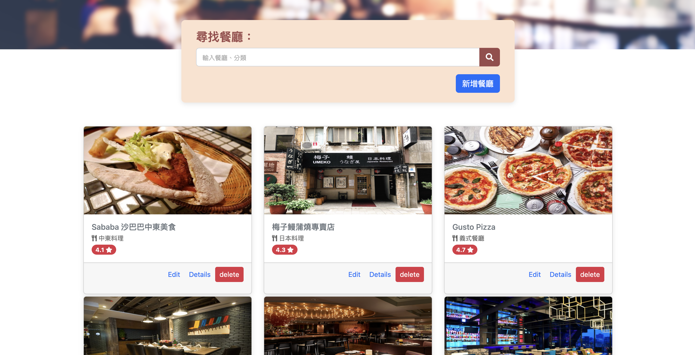

# 我的餐廳清單



## 介紹

可供使用者儲存喜愛餐廳的網站，紀錄屬於自己的餐廳清單，可以瀏覽餐廳、查看詳細資訊、甚至連結到地圖。

### 功能
- 使用者可以註冊會員並重新登入使用餐廳清單
- 使用者可以登入會員使用餐廳清單
- 使用者可以新增餐廳資料
- 使用者可以修改餐廳資料
- 使用者可以刪除餐廳資料
- 使用者可以在首頁看到所有餐廳與它們的簡單資料：
   - 餐廳照片
   - 餐廳名稱
   - 餐廳分類
   - 餐廳評分
- 使用者可以再點進去看餐廳的詳細資訊：
   - 類別
   - 地址
   - 電話
   - 描述
   - 圖片
   - 使用者可以透過搜尋餐廳名稱來找到特定的餐廳
## 開始使用

1. 請先確認有安裝 node.js 與 npm
2. 將專案 clone 到本地
3. 在本地開啟之後，透過終端機進入資料夾，輸入：

   ```bash
   npm install
   ```

4. 安裝完畢後，繼續輸入：

   ```bash
   npm run start
   ```

5. 若看見此行訊息則代表順利運行，打開瀏覽器進入到以下網址

   ```bash
   Listening on http://localhost:3000
   ```

6. 若欲暫停使用

   ```bash
   ctrl + c
   ```

## 開發工具
- Visual Studio Code
- Node.js 14.16.0
- Bootstrap 5.2.1
- Font-awesome 5.8.1
- Express": "^4.18.2",
- Express-handlebars": "^4.0.2",
- MongoDB
- Mongoose": "^5.9.16"


